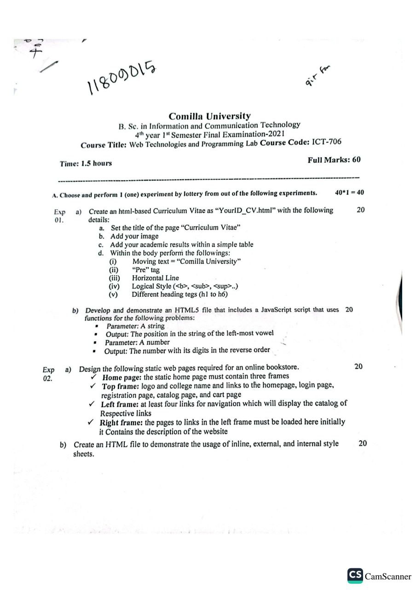
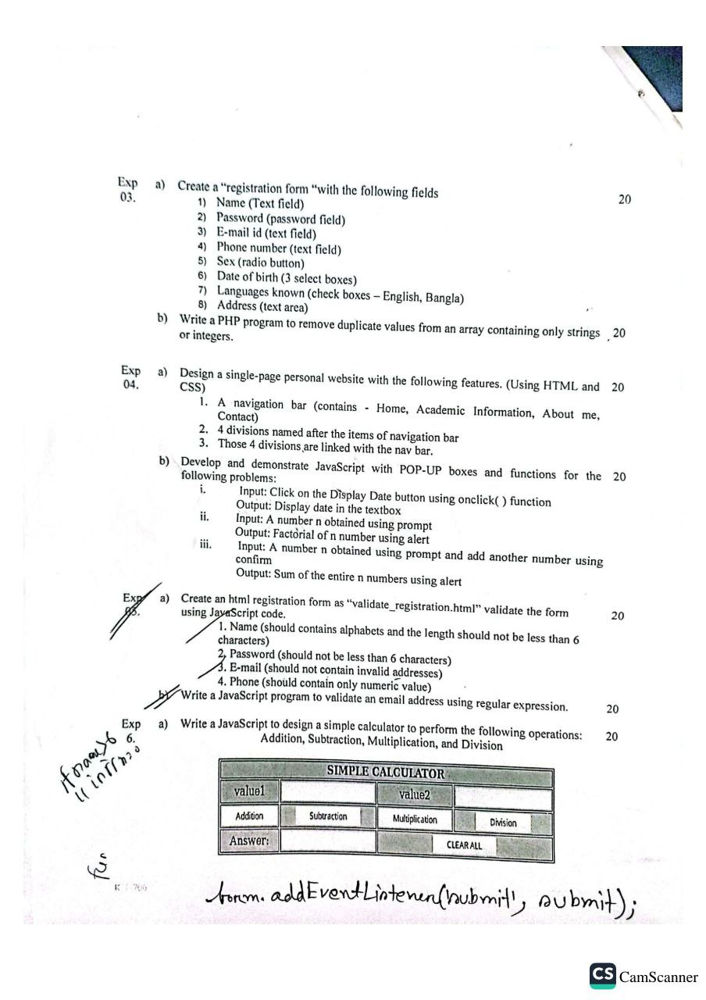
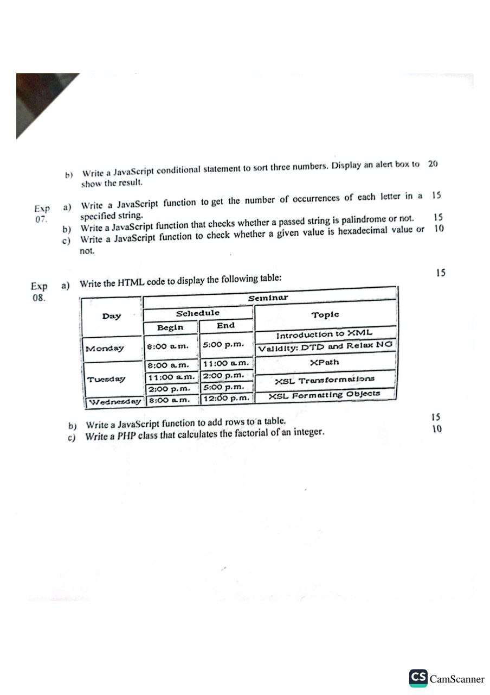

# Web technology lab code solution(2021)
Session 2017-18 | Batch-9
The course instructed by Md. Rakib Hasan Sir.

## Help?
- Just download or clone the repository and explore.
- These codes are fully tested and you can customize on your own.
- If you find any faults, you can create an issue. 

## Question Paper

